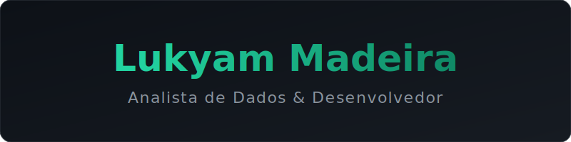

  

 

---

### 🧰 Ferramentas · Tools

**📊 Dados & BI**

  
  
  
  
  
  
  
  
  

 

**💻 Desenvolvimento & Automação**

  
  
  
  
  
  
  
  
  

 

**🤖 Inteligência Artificial**

  
  
  
  
  

 

**⚙️ Infraestrutura & Workflow**

  
  
  
  

---

## 🇺🇸 English

**Data Analyst & Developer** focused on simplifying operations, automating workflows, and building dashboards that help teams make precise, data-driven decisions.

I take chaotic spreadsheets, paper-based processes, and unstructured data, and turn them into reliable web applications and automated pipelines. My main focus has been healthcare operations and quality, but the tools I build (ETL automation, management dashboards, internal systems) improve information quality in any business area.

#### 🚀 Project Portfolio

Below are some of the systems, automations, and dashboards I've built (most of them from scratch, running in production). Since the number of repositories is large, I've grouped them by technical focus area:

**📊 Business Intelligence & Analytics** — Projects focused on data modeling, quality handling, DAX/SQL, and decision-support reporting.
- **[Healthcare Quality BI Analytics](https://github.com/Lukyammm/healthcare-quality-bi-analytics)**: Complete BI case study with dimensional modeling, KPI definitions, SQL data-quality checks, and DAX measures for Power BI.
- **[Patient Experience Analytics](https://github.com/Lukyammm/patient-experience-analytics)**: NPS survey analytics with cleanup routines, cross-referenced sector data, and satisfaction history.
- **[Patient Safety Analytics](https://github.com/Lukyammm/patient-safety-analytics)**: Operational and safety indicator dashboard with configured alerts and automated management reports.
- **[Hospital Quality Bulletin Dashboard](https://github.com/Lukyammm/hospital-quality-bulletin-dashboard)**: Quality-management panel focused on daily goal and KPI analysis.

**⚙️ Process Automation & ETL** — Tools built to replace chronic manual work, route data intelligently, and ensure compliance.
- **[Spreadsheet Intake Automation](https://github.com/Lukyammm/spreadsheet-intake-automation)**: Full intake pipeline (CSV/XLSX) with structured cleanup routines, business-rule validation, and automated import.
- **[Locker Custody Workflow](https://github.com/Lukyammm/locker-custody-workflow)**: Automated custody workflow with continuous audit trail, logical-state monitoring, and notification triggers.
- **[Internal Communication Platform](https://github.com/Lukyammm/internal-communication-platform)**: Back-office portal that automates internal announcement workflows while keeping structured submission logs.
- **[Shift Handoff Workflow](https://github.com/Lukyammm/shift-handoff-workflow)**: Automation that consolidates shift-handoff logs, bringing standardization to previously unstructured data.

**💻 Internal Web Applications** — Complete systems handling access control (RBAC), caching, protection against concurrent access, and encryption.
- **[Clinical Operations Command Center](https://github.com/Lukyammm/clinical-operations-command-center)**: Interactive governance and process-management dashboard with recurring data snapshots and full RBAC.
- **[Rapid Response Triage Platform](https://github.com/Lukyammm/rapid-response-triage-platform)**: Robust tracking and SLA system for triage calls. Uses salted password hashing and lockout for security.
- **[Institutional Access Governance Portal](https://github.com/Lukyammm/institutional-access-governance-portal)**: Scalable access-control system implementing document locks to handle concurrent writes across thousands of records.

> 💡 *I have dozens of other hands-on repositories. Feel free to explore all my projects in the [Repositories](https://github.com/Lukyammm?tab=repositories) tab.*

<a href="#top">⬆ back to top</a>

---

## 🇧🇷 Português

**Analista de Dados & Desenvolvedor** focado em descomplicar operações, automatizar rotinas e estruturar dashboards que ajudam equipes a tomar decisões precisas e baseadas em dados.

Pego planilhas caóticas, processos de papel e dados não estruturados, e transformo em aplicações web confiáveis e pipelines automatizados. Minha base principal de atuação tem sido operações e qualidade hospitalar, mas as ferramentas que construo (automação de ETL, dashboards gerenciais, sistemas internos) otimizam a qualidade da informação em qualquer área de negócio.

#### 🚀 Portfólio de Projetos

Abaixo estão alguns dos sistemas, automações e dashboards que desenvolvi (a maioria construída do zero para rodar em produção). Como o volume de repositórios é grande, agrupei por área de foco tecnológico:

**📊 Business Intelligence & Analytics** — Projetos focados em modelagem de dados, tratamento de qualidade, DAX/SQL e criação de relatórios de apoio à decisão.
- **[Healthcare Quality BI Analytics](https://github.com/Lukyammm/healthcare-quality-bi-analytics)**: Case completo de BI com modelagem dimensional, definição de KPIs, checagem de qualidade de dados em SQL e medidas DAX para Power BI.
- **[Patient Experience Analytics](https://github.com/Lukyammm/patient-experience-analytics)**: Analytics de pesquisa NPS com rotinas de limpeza, cruzamento de dados setorizados e histórico de satisfação.
- **[Patient Safety Analytics](https://github.com/Lukyammm/patient-safety-analytics)**: Dashboard de indicadores operacionais e segurança, com alertas configurados e relatórios gerenciais automatizados.
- **[Hospital Quality Bulletin Dashboard](https://github.com/Lukyammm/hospital-quality-bulletin-dashboard)**: Painel de gestão da qualidade focado na análise diária de metas e KPIs.

**⚙️ Automação de Processos & ETL** — Ferramentas criadas para substituir trabalho manual crônico, rotear dados de forma inteligente e garantir conformidade.
- **[Spreadsheet Intake Automation](https://github.com/Lukyammm/spreadsheet-intake-automation)**: Pipeline completo de entrada (CSV/XLSX) com rotinas de limpeza estruturada, validação de regras de negócios e importação automatizada.
- **[Locker Custody Workflow](https://github.com/Lukyammm/locker-custody-workflow)**: Workflow automatizado de custódia com trilha de auditoria contínua, monitoramento de estados lógicos e disparo de notificações.
- **[Internal Communication Platform](https://github.com/Lukyammm/internal-communication-platform)**: Portal back-office para automatizar rotinas de comunicados internos mantendo logs de submissão estruturados.
- **[Shift Handoff Workflow](https://github.com/Lukyammm/shift-handoff-workflow)**: Automação para consolidar logs de passagem de plantão, trazendo padronização para dados anteriormente desestruturados.

**💻 Aplicações Web Internas** — Sistemas completos que lidam com controle de acesso (RBAC), cache, proteção contra acessos simultâneos e criptografia.
- **[Clinical Operations Command Center](https://github.com/Lukyammm/clinical-operations-command-center)**: Dashboard interativo de gestão de governança e processos, com snapshot recorrente de dados e RBAC completo.
- **[Rapid Response Triage Platform](https://github.com/Lukyammm/rapid-response-triage-platform)**: Sistema robusto de rastreio e SLA para chamados de triagem. Usa hashing de senha com salt e bloqueio (lockout) para segurança.
- **[Institutional Access Governance Portal](https://github.com/Lukyammm/institutional-access-governance-portal)**: Sistema escalável focado em controle de acesso com implementação de *document locks* para lidar com escrita concorrente de milhares de registros.

> 💡 *Tenho dezenas de outros repositórios práticos. Fique à vontade para explorar todos os meus projetos na aba [Repositories](https://github.com/Lukyammm?tab=repositories).*

<a href="#top">⬆ voltar ao topo</a>

---

### 📊 Números · Stats

  

  <picture>
    <source media="(prefers-color-scheme: dark)" srcset="https://raw.githubusercontent.com/Lukyammm/Lukyammm/output/github-contribution-grid-snake-dark.svg">
    <source media="(prefers-color-scheme: light)" srcset="https://raw.githubusercontent.com/Lukyammm/Lukyammm/output/github-contribution-grid-snake.svg">
    
  </picture>

---

### 📬 Contato · Contact

Bora trocar uma ideia? · Let's talk?

  
  

